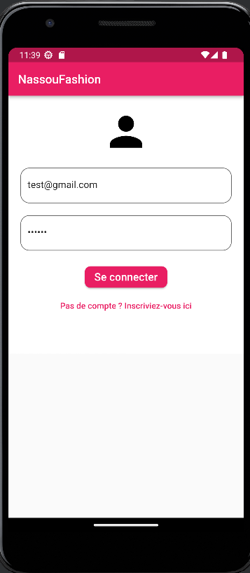
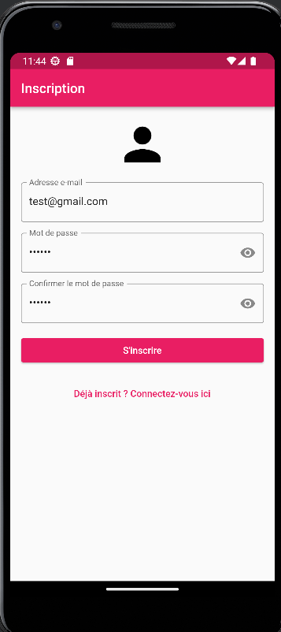
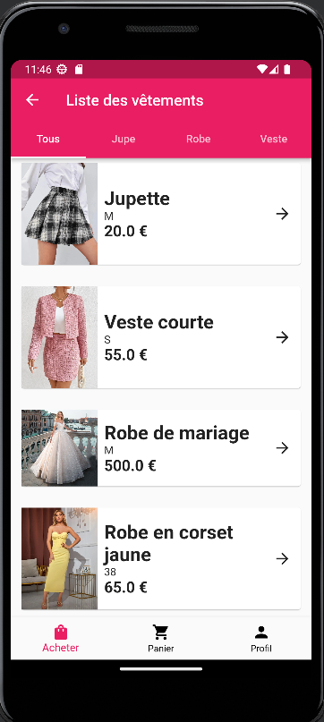
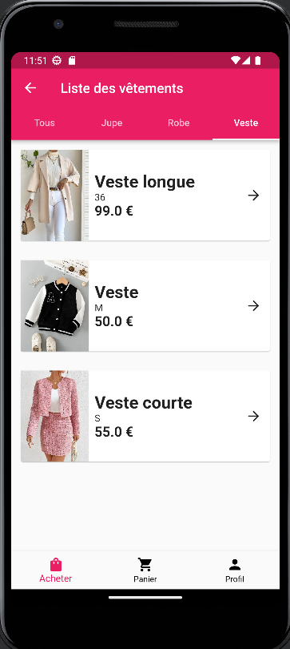
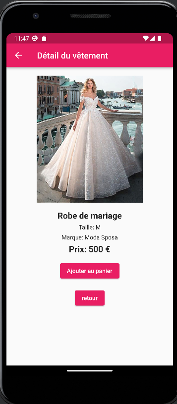
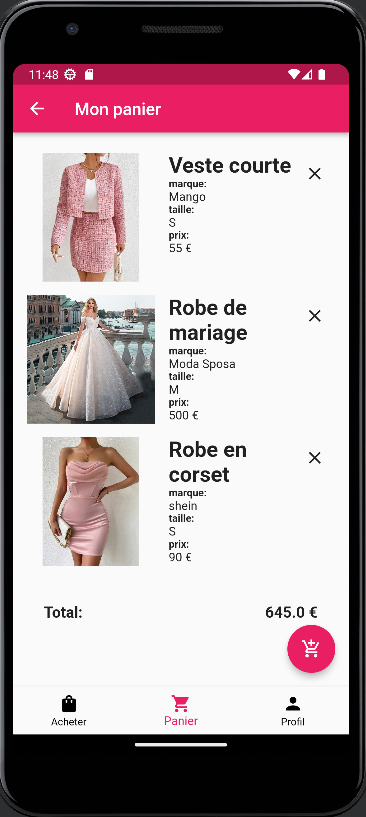
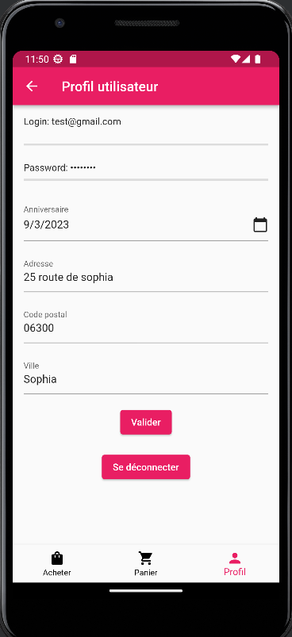

# Miaged
Users1
-Login:test@gmail.com
-Password: test96

  
   
  
  
  
  
  

Ce projet consistais à développer une version light de l’application Vinted que j'ai nommé 'NassouFashion'. 

##### le [MVP] que j'ai développé 

US#1 : [MVP] Interface de login
En tant qu'utilisateur, je souhaite pouvoir me connecter à l'application afin d'accéder à la page suivante.
Critère d'acceptance #1 : Au lancement de l'application, une interface de login composée d'un headerBar qui contient le nom de l'application, de deux champs et d'un bouton m'est proposée
Critère d'acceptance #2 : Les deux champs de saisie sont : Login et Password
Critère d'acceptance #3 : Le champ de saisie du password est obfusqué
Critère d'acceptance #4 : Le label du bouton est : Se connecter
Critère d'acceptance #5 : Au clic sur le bouton « Se connecter », une vérification en base est réalisée. Si l'utilisateur existe, celui-ci est redirigé sur la page suivante. Si celui-ci n'existe pas, à minima un log est affiché dans la console et l'application reste fonctionnelle
Critère d'acceptance #6 : Au clic sur le bouton « Se connecter » avec les deux champs vides, l'application doit rester fonctionnelle

US#2 : [MVP] Liste de vêtements
En tant qu'utilisateur connecté, je souhaite voir la liste des vêtements afin de choisir ceux qui m'intéressent.
Critère d'acceptance #1 : Une fois connecté, l'utilisateur arrive sur cette page composée du contenu principal et d'une BottomNavigationBar composée de trois entrées et leurs icônes correspondantes : Acheter, Panier et Profil
Critère d'acceptance #2 : La page actuelle est la page Acheter. Son icône et son texte sont d'une couleur différente des autres entrées
Critère d'acceptance #3 : Une liste déroulante de tous les vêtements m'est proposée à l'écran
Critère d'acceptance #4 : Chaque vêtement affiche les informations suivantes :
Une image (ne pas gérer les images dans l'application, seulement insérer des liens vers des images d'internet)
Un titre
La taille
Le prix
Critère d'acceptance #5 : Au clic sur une entrée de la liste, le détail est affiché (voir US#3)
Critère d'acceptance #6 : Cette liste de vêtements est récupérée de la base de données

US#3 : [MVP] Détail d’un vêtement
En tant qu’utilisateur connecté, je souhaite voir le détail d’un vêtement afin de pouvoir vérifier s’il me 
convient et l’ajouter dans mon panier
Critère d’acceptance #1 : La page de détail est composée des informations suivantes :
• Une image
• Un titre
• La taille
• La marque
• Le prix
Critère d’acceptance #2 : La page est également composée d’un bouton « Retour » pour retourner à la 
liste des vétements et d’un bouton « Ajouter au panier », ajoutant le vêtement dans le panier de 
l’utilisateur (ajout en base)

US#4 : [MVP] Le panier
En tant qu’utilisateur connecté, je souhaite voir mon panier afin de le vérifier avant achat
Critère d’acceptance #1 : Au clic sur le bouton « Panier », la liste des vêtements du panier de l’utilisateur 
est affichée avec les informations suivantes : 
• Une image (ne pas gérer les images dans l’application, seulement insérer des liens vers des 
images d’internet)
• Un titre
• La taille
• Le prix
Critère d’acceptance #2 : Un total général est affiché à l’utilisateur (somme de tous les vêtements du 
panier)
Critère d’acceptance #3 : A droite de chaque vetement, une croix permet à l’utilisateur de retirer un 
produit. Au clic sur celle-ci, le produit est retiré de la liste et le total général mis à jour
Critère d’acceptance #4 : Aucun autre bouton d’action n’est présent sur la page (pas de paiement pour 
le moment)

US#5 : [MVP] Profil utilisateur
En tant qu’utilisateur connecté, je souhaite accéder aux informations de mon profil afin d’en vérifier 
l’exactitude et de les modifier sur besoin
Critère d’acceptance #1 : Au clic sur le bouton « Profil », les informations de l’utilisateur s’affichent 
(récupérées en base de données) 
Critère d’acceptance #2 : Les informations sont : 
• Le login (readonly)
• Le password (offusqué) 
• L’anniversaire
• L’adresse
• Le code postal (affiche le clavier numérique et n’accepte que les chiffres)
• La ville
Critère d’acceptance #3 : Un bouton « Valider » permet de sauvegarder les données (en base de 
données)
Critère d’acceptance #4 : Un bouton « Se déconnecter » permet de revenir à la page de login

US#6 : Filtrer sur la liste des vêtements
US#7 : Laisser libre cours à votre imagination

### Pour la connection:
J'ai créer deux utilisateurs
Users1
-Login:test@gmail.com
-Password: test96
Users2
-Login:nassouk96@gmail.com
-Password: nassou

.
